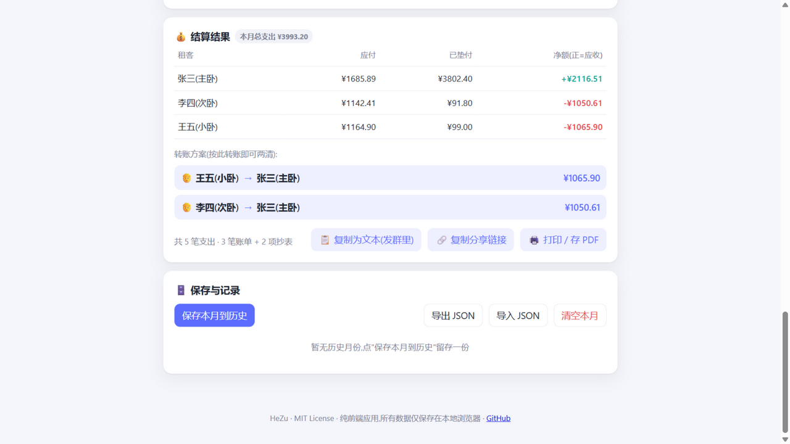

# 🏠 合租账本 HeZu

[](https://github.com/qlw088697-ui/hezu/actions/workflows/ci.yml)

> 合租费用分摊计算器 —— 房租、水电燃气抄表、公共开销 AA,一键算出每人应付和互相转账方案。中英双语界面。

**在线使用(无需安装):[GitHub Pages 演示](https://qlw088697-ui.github.io/hezu/)**


## 这解决什么问题?

合租生活里,每个月底算账总是最头疼的时刻:

- 水电燃气要**抄表算钱**,再按人头摊
- 房间大小不同,房租可能**按权重分**
- 网费、清洁用品等公共开销要 **AA**
- 总有一个人**先垫付**,最后要互相转账
- 在群里手算,算错一次就要扯皮一晚上

合租账本把这些一次算清,生成的结果可以直接复制粘贴到微信群里。

## 功能

- 👥 **租客管理**:每位租客可设置权重(如主卧 1.5、次卧 1);支持**批量粘贴名单**一键添加,姓名框回车快速续录
- 🚪 **房间租金表**(可选):给房间填月租和住客,账单"按房间"分摊,房租自动等于各人房间租金之和
- 🧾 **账单项**:支持四种分摊方式
  - **均摊** —— 所有参与人平分(余数自动处理,合计分毫不差)
  - **按权重** —— 按租客权重比例分摊(最大余数法)
  - **按房间** —— 金额自动等于各参与人房间租金之和
  - **自定义份额** —— 每人手动填金额,合计对不上会自动提醒
- 📥 **CSV 导入账单**:CSV 含"名称"和"金额"两列表头即可批量导入(自动识别 UTF-8/GBK 编码,兼容 Excel 中文导出;引号字段、千分位、货币符号均容错)
- 💡 **抄表计费**:填上期/本期读数和单价,自动算出金额并分摊,读数异常会提醒
- 💰 **垫付与结算**:记录每笔支出谁垫付的,自动生成"A → B ¥xx"的最简转账方案(贪心算法)
- 🔗 **分享链接**:整份账单编码进网址,发给室友,对方打开即见同样的账单,无需注册、无需服务器
- 📋 **一键复制**结果为纯文本,🖼️ **结算卡片存为图片**(渐变卡片、彩色净额,发群里更直观)、📊 **导出结算 CSV**(UTF-8 BOM,Excel 直接打开)、📤 **系统原生分享**(移动端,支持图片+文字一起分享),🖨️ **打印/存 PDF** 留档
- 🌍 **中英双语**:首次访问按浏览器语言自动选择,右上角一键切换并记住选择
- 🌙 **深色模式**:跟随系统自动切换,也可手动固定浅色/深色;📱 手机、平板、电脑自适应
- 🗄️ **按月保存历史**(支持只读查看任意月份详情)+ 📈 **月度趋势图(按人彩色堆叠)** + 📊 **累计统计**(跨月汇总每人应付/垫付/净额)、导出 / 导入 JSON、⬇️ 全量备份
- 💾 **全量备份/恢复**:当前月份 + 全部历史打包成一个 JSON,换设备或清浏览器数据前一键备份,导入自动识别、整体消毒恢复
- 📋 **一键复制历史账单**:下个月房租不用重录——从历史月份复制账单结构,成员按名字智能匹配,抄表上期读数自动衔接上月本期读数,覆盖前确认、可撤销
- ↩️ **误操作保护**:清空本月、删除成员/账单/抄表/房间/历史月份均可一键撤销;⌨️ 账单名称根据历史输入自动补全
- 📲 **PWA**:支持"添加到主屏幕",安装后**离线可用**(Service Worker 缓存)
- 🎁 **示例数据**:首次打开点一下"载入示例数据",秒懂用法
- 🔒 **隐私与安全**:纯前端单文件应用,无后端、无登录、无追踪,所有数据只存在你自己的浏览器 `localStorage` 里;所有外部数据入口(导入/分享链接/历史/存储)都经过**数据消毒器**规范化,渲染层全部转义,杜绝注入;并通过 **CSP 内容安全策略**在浏览器层面禁止一切外部网络请求——"数据不出本地"是浏览器强制执行的承诺



## 使用

1. 打开 [在线演示](https://qlw088697-ui.github.io/hezu/)(或直接双击 `index.html`,离线也能用)
2. 第一次不知道怎么下手?点"🎁 一键载入示例数据"看看效果
3. 添加租客 → 录入账单和抄表数据
4. 查看结算结果,点"复制为文本"或"复制分享链接"发到群里
5. 满意的月份点"保存本月到历史",下月新建

## 技术说明

- 纯原生 HTML/CSS/JavaScript,核心是单文件 `index.html`,零依赖、零构建
- 金额全部以"分"为单位计算,均摊余数与按权重分摊采用最大余数法,保证每人金额合计 === 总额
- 转账方案采用贪心结算(欠款最多的人优先收款),生成的转账笔数接近最少
- 分享链接把账单状态压缩编码进 URL hash(`#d=...`),不经过任何服务器
- PWA 图标由 `tools/gen-icons.js` 纯 Node 程序化生成(手写 PNG 编码器,无图像库依赖)

## 本地运行

无需任何环境,直接用浏览器打开 `index.html` 即可;要体验离线安装(PWA),通过任意静态服务器或 GitHub Pages 访问。

## 开发

```bash
node test/test.js   # 运行测试:语法检查 + 分摊/结算/房间算法 + 数据消毒 + 分享链接编解码 + CSV 解析/导入 + 历史复制 + 备份解析 + 快照计算 + 跨月累计(75 项断言)
node tools/gen-icons.js  # 重新生成 PWA 图标
```

每次 push 会由 GitHub Actions 自动运行测试(见 `.github/workflows/ci.yml`)。

## English

**HeZu** is a tiny, dependency-free bill splitter for shared apartments (co-renting). Split rent by room weight, split utility bills by meter readings, record who paid upfront, and get minimal transfer instructions ("B pays A ¥xx") — all in a single-file, offline-capable web app. Your data never leaves your browser. Open the [live demo](https://qlw088697-ui.github.io/hezu/), click "载入示例数据" to load a sample, and start splitting.

## License

[MIT](LICENSE)
